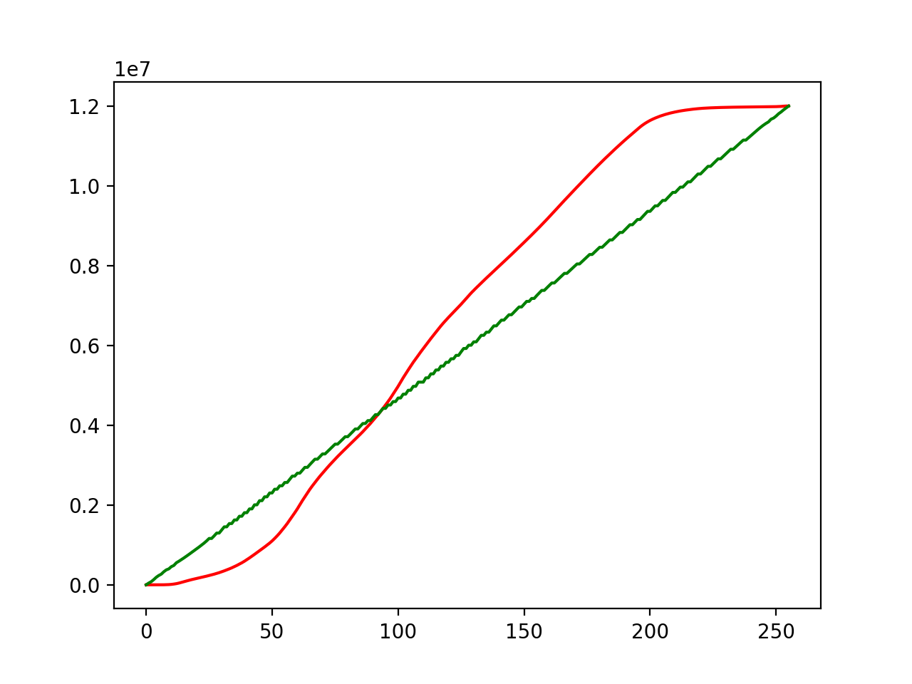
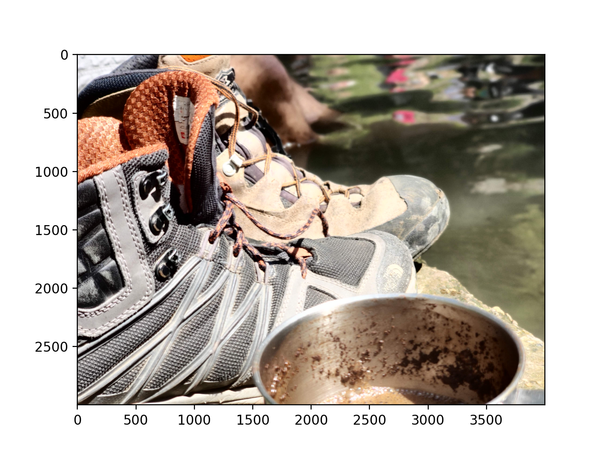
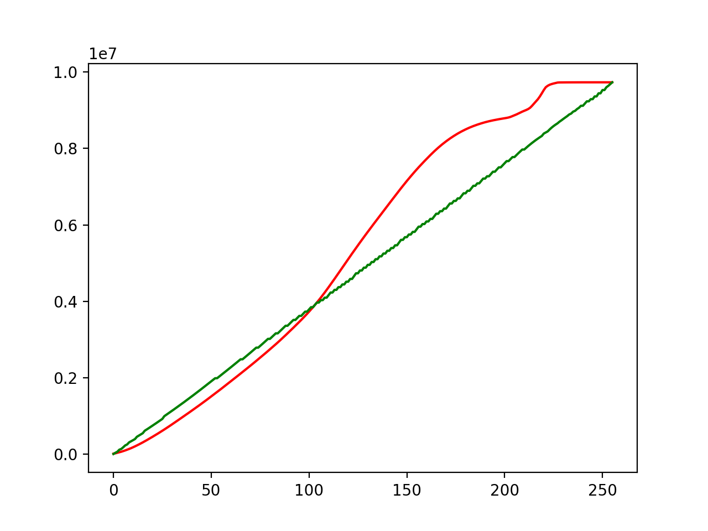
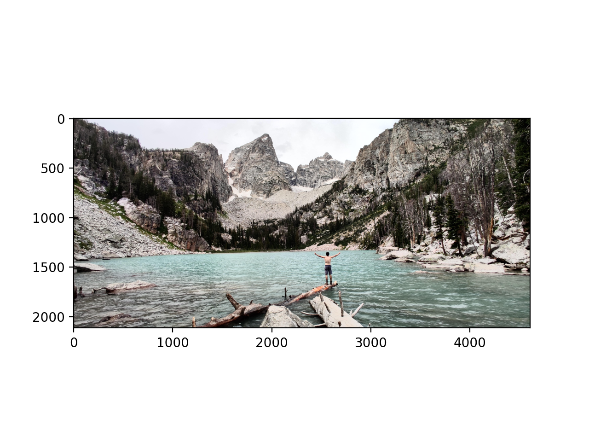
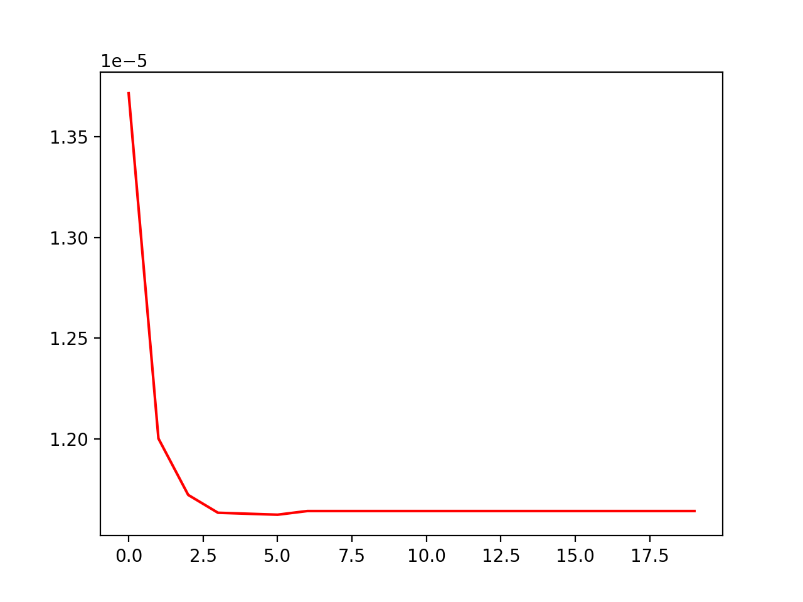
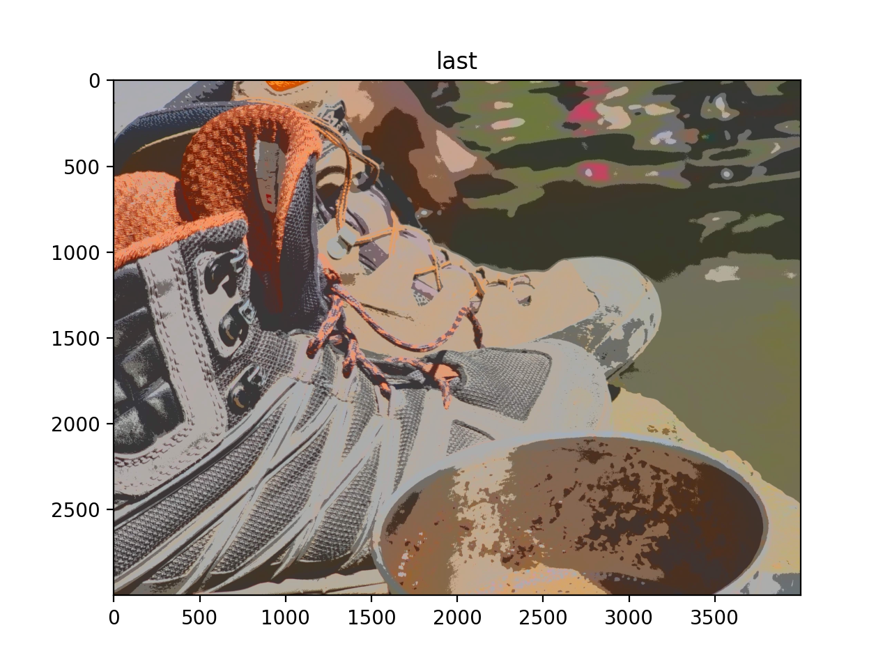
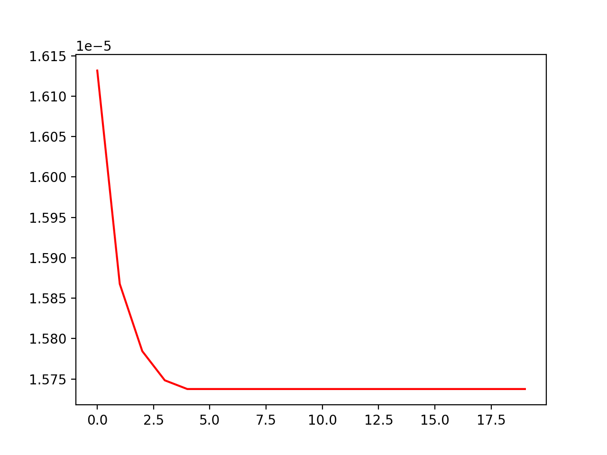
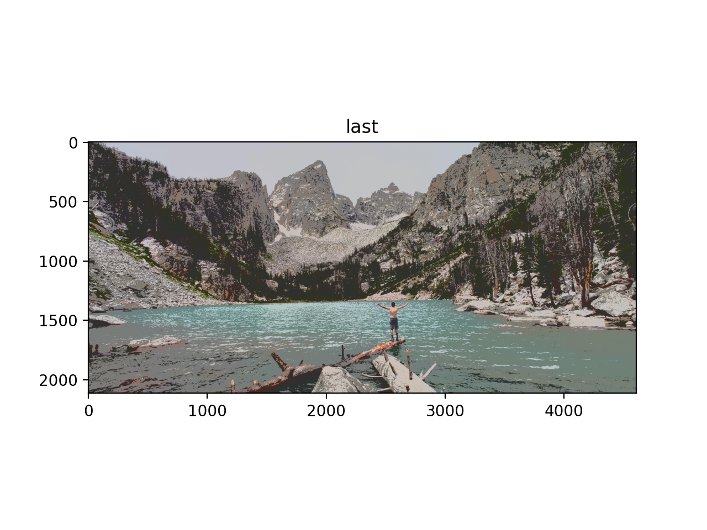
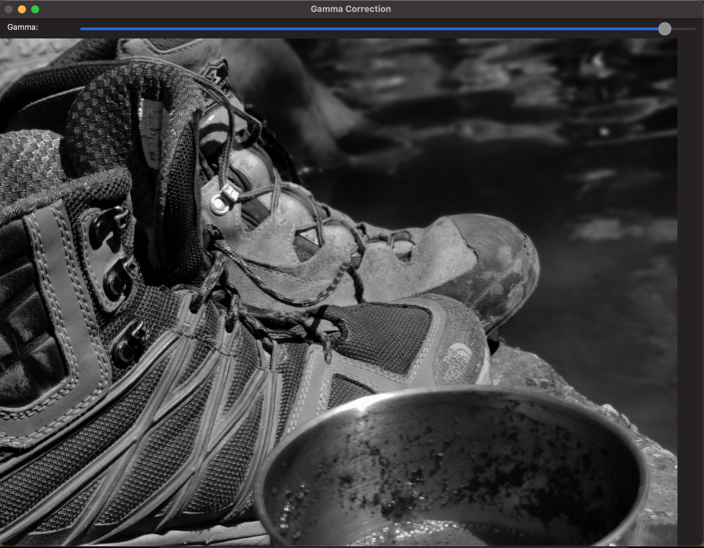

<html lang='en'>
<header>
    <h1>
    Ex1 Computer Vision
    </h1>
    <h2>python version: 3.9 </h2>
</header>
<body>

`ex1_main.py` supplied file for tests  

`ex1_utils.py` main utilities file containing all implemented functions except gammaDisplay  

`gamma.py` contains gammaDisplay function

 

<table>
    <th>
    <tr>
    <td></td>
        <td>
        testImg1.jpg
        </td>
        <td>
        testImg2.jpg
        </td>
        </tr>
    </th>
    <tb>
    <tr><td>original</td><td></td><td></td></tr>
    <tr><td>equalized</td><td></td><td></td></tr>
    <tr><td>quanitized to 3 colors</td><td></td><td></td></tr>
    <tr><td>gamma correction</td><td></td><td></td></tr>
    </tb>
</table>
<h2>The Task pdf:</h2>
<object data="Ex1.pdf" type="application/pdf" width="700px" height="700px">
    <embed src="Ex1.pdf">
        
This browser does not support PDFs. Please open the PDF to view it: 
        

[Ex1.pdf](Ex1.pdf)

</embed>
</object>
</body>
<footer>Achiya Zigler</footer>
</html>
